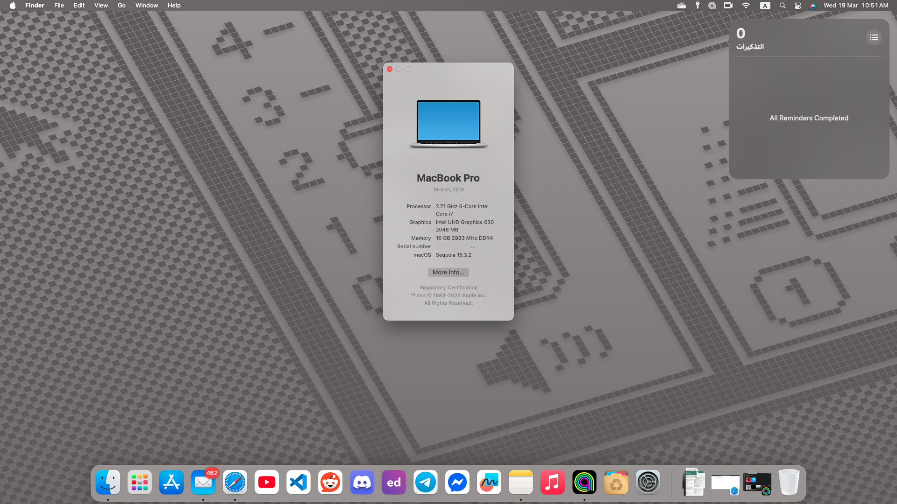

# Dell Latitude 5511 with macOS Sequoia
A collection of files needed to run Sequoia & Sonoma on a Dell Latitude 5511.

## 💻 Status
| Hardware | Model | Status | Comments |
| ------------- | ------------- | ------------- | ------------- |
| **CPU** | Intel Core i7-10850H | ✅ Working | Power Management fully working. Goes down to 800MHz and boosts to 5.1GHz. 2-3W power consumption in idle stage. |
| **iGPU** | Intel UHD Graphics 630 | ✅ Working | Fully supported including Turbo, QE/CI acceleration, Metal and 2GiB of VRAM but no DRM in Safari |
| **dGPU** | NVIDIA GeForce MX250 | ❌ Not working | It was disabled by ACPI because it was not supported on macOS |
| **Sound Card** | Realtek ALC3204 | ✅ Working | Fully working including Mac boot chime |
| **Wireless Card** | Intel AX201 | ✅ Working | Includes Wi-Fi and Bluetooth, both work. |
| **LAN Card** | Intel I219-LM | ✅ Working | |
| **SSD** | KINGSTON SA400S37240G⁩ SSD 240GB | ✅ Working |
| **NVMe**| PC611 NVMe SK hynix 512GB | ❌ Not working | It was disabled by ACPI because it was not supported on macOS and was causing kernel panics |
| **Trackpad** | I2C HID Device | ✅ Working | Works with all macOS gestures support, but drag and drop does not work.~ |
| **Webcam** |  | ✅ Working |
| **HDMI Port** | HDMI 2.0 | ✅ Working | HDMI Audio is not working |
| **USB Ports** | | ✅ Working | All Ports fully working with USB 2.0, 3.0 and 3.1/3.2 speed |
| **Thunderbolt/ USB-C** | Intel JHL7540 | ✅ Working | USB-C charging works. USB-C to HDMI or (m)DP adapters are working. |
| **SD reader** | Realtek RTS525A | ✅ Working |

## 🎖️ Features
| Features | Status | Comments |
| ------------- | ------------- | ------------- |
| **Sleep** | ✅ Working |
| **Lid Open/Close** | ✅ Working | Goes to Sleep when no external display connected and wakes up.
| **iMessage and App Store** | ✅ Working | Just use a valid SMBIOS, S/N, MLB and MAC-Address. Do not use the random data in my repo as these may be used by others! |

## 🛠️ Fix problems

### Fix Wi-Fi in sequoia
- First method
  1. Download [itlwm.kext](https://github.com/OpenIntelWireless/itlwm/releases) & [Heliport.dmg](https://github.com/OpenIntelWireless/HeliPort/releases)
  2. Add **itlwm.kext** in `EFI/OC/kext`
  3. Install **Heilport**
  4. Take a snapshot for `config.plist` by propertree
  5. Restart your Device
  
- Second method (spoofing Wi-Fi)
  1. Download [OpenCore-Patcher.pkg](https://github.com/dortania/OpenCore-Legacy-Patcher) & [OCAT](https://github.com/ic005k/OCAuxiliaryTools) & [Hackintool](https://github.com/benbaker76/Hackintool), then install them.
  2. Download [AMFIPass.kext](https://github.com/dortania/OpenCore-Legacy-Patcher/tree/main/payloads/Kexts/Acidanthera) & [IOSkywalkFamily.kext](https://github.com/dortania/OpenCore-Legacy-Patcher/tree/main/payloads/Kexts/Wifi) &   [IO80211FamilyLegacy.kext](https://github.com/dortania/OpenCore-Legacy-Patcher/tree/main/payloads/Kexts/Wifi), then add in `EFI/OC/kext`
  3. Take a snapshot for `config.plist` by propertree
  4. You must know the Device path of the network card by opening `Hackintool > PCIe > Device path`, then copy it.
  5. Open `config.plist` by OCAT.
  6. Go to `device properties`, then replace `#PciRoot(0x0)/Pci(0x14,0x3)` with your Device path, if the Device path is the same, just remove `#`.
  7. Disable Secure Boot: Go to `Misc > Security > SecureBootMdel`,then disable it. .
  8. Disable SIP; Go to `NVRAM > 7C436110-AB2A-4BBB-A880-FE41995C9F82 > csr-active-config`, then set its `value = 030A0000`
  9. Restart your Device
  10. Run OCLP, then click `Post-install Root Patch`, then click `Start Root Patching`
  11. After applying the patch, disable spoofing by adding `#` before the Device path, as it was in its previous state, and do not enable Secure Boot and SIP.

### Fix drag and drop in trackpad
1. Download [VoodooSMBus.kext](https://github.com/VoodooSMBus/VoodooSMBus/releases)
2. Delete all Voodoo from `EFI/OC/kext`, and keep `VoodooPS2Controller.kext`, then add `voodooSMBus.kext`
3. Take a snapshot for `config.plist` by propertree
4. Restart your Device

## 🖥 Installation

### BIOS/UEFI settings
- Secure Boot: Off (Default: On)
- SATA Mode: AHCI (Default: RAID) (Also includes NVMe drives! macOS will not see any drives when using RAID mode)
- Intel SGX: Software Controlled or Off
- Thunderbolt Configuration: No Security

### ⚡️ Performance
CPU power management is done by `CPUFriend.kext` while `CPUFriendDataProvider.kext` defines how it should be done. `CPUFriendDataProvider.kext` is generated for a specific CPU and power setting. The one supplied in this repository was made for the Intel Core i7-10850H and is optimized for optimized performance (like on normal MacBook Pro's). In case you have another CPU, you must create a `CPUFriendDataProvider.kext` for your processor.
- `CPUFriendDataProvider.kext` must be disabled before installing the macOS, then restart it after installation

 ### ✍🏻 Conclusion
 I hope I was able to help you, and that everything goes perfectly and Hackintosh installs as expected. 😊
