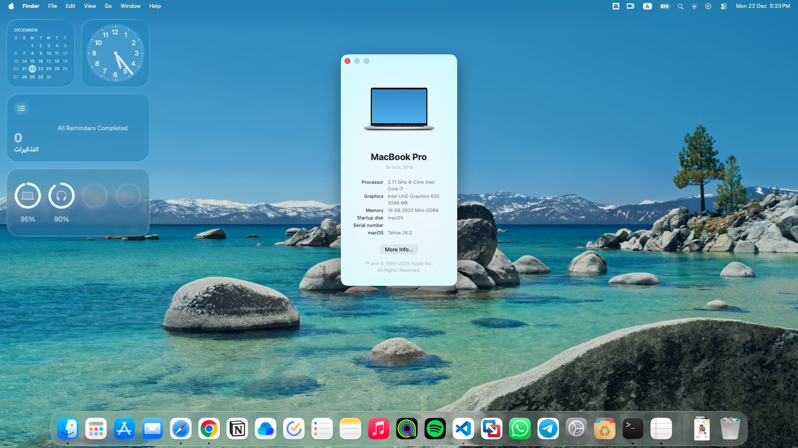

# Dell Latitude 5511 with macOS Tahoe (Opencore 1.0.6)
A collection of files needed to run Tahoe & Sequoia & Sonoma on a Dell Latitude 5511.

## 💻 Status
| Hardware | Model | Status | Comments |
| ------------- | ------------- | ------------- | ------------- |
| **CPU** | Intel Core i7-10850H | ✅ Working | Power Management fully working. Goes down to 800MHz and boosts to 5.1GHz. 2-3W power consumption in idle stage. |
| **iGPU** | Intel UHD Graphics 630 | ✅ Working | Fully supported including Turbo, QE/CI acceleration, Metal and 2GiB of VRAM but no DRM in Safari |
| **dGPU** | NVIDIA GeForce MX250 | ❌ Not working | It was disabled by ACPI because it was not supported on macOS |
| **Sound Card** | Realtek ALC3204 | ✅ Working | Fully working including Mac boot chime (By spoofing) |
| **Wireless Card** | Intel AX201 | ✅ Working | Includes Wi-Fi and Bluetooth, and both work. However, the Wi-Fi only works with HeliPort. |
| **LAN Card** | Intel I219-LM | ✅ Working | |
| **SSD** | KINGSTON SA400S37240G⁩ SSD 240GB | ✅ Working |
| **NVMe**| 2550 micron 512GB | ✅ working |
| **Trackpad** | I2C HID Device | ✅ Working | Works with all macOS gestures support, but drag and drop does not work. |
| **Webcam** |  | ✅ Working |
| **HDMI Port** | HDMI 2.0 | ✅ Working | HDMI Audio is not working |
| **USB Ports** | | ✅ Working | All Ports fully working with USB 2.0, 3.0 and 3.1/3.2 speed |
| **Thunderbolt/ USB-C** | Intel JHL7540 | ✅ Working | USB-C charging works. USB-C to HDMI or (m)DP adapters are working. |
| **SD reader** | Realtek RTS525A | ✅ Working |

## 🎖️ Features
| Features | Status | Comments |
| ------------- | ------------- | ------------- |
| **Sleep** | ✅ Working |
| **Lid Open/Close** | ✅ Working | Goes to Sleep when no external display connected and wakes up.
| **iMessage and App Store** | ✅ Working | Just use a valid SMBIOS, S/N, MLB and MAC-Address. Do not use the random data in my repo as these may be used by others! |

## 🖥 Before Installation

### Create USBMapp
It is important to create a new USBMap specific to your device before installing the macOS Tahoe. To create a USBMap, Download [USBToolBox](https://github.com/USBToolBox/tool/releases) and follow [this guide](https://github.com/USBToolBox/tool.git). Then follow the rest of the steps.

1. Download [Propertree](https://github.com/corpnewt/ProperTree.git) & Install [Python](https://www.python.org/downloads/)
2. Make sure that files **USBToolBox.kext** and **UTBMap.kext** which you recently created, are located in this path. `EFI/OC/kext`.
3. Take a snapshot for `config.plist` by propertree

>Disable these kexts **IntelBluetoothFirmware.kext**, **BlueToolFixup.kext**, **IntelBTPatcher**, **CPUFriend.kext**,  **CPUFriendDataProvider.kext**. To avoid kernal panic, Then enable them after installation.

### BIOS/UEFI settings
- Secure Boot: Off (Default: On)
- SATA Mode: AHCI (Default: RAID) (Also includes NVMe drives! macOS will not see any drives when using RAID mode)
- Intel SGX: Software Controlled or Off
- Thunderbolt Configuration: No Security

### Performance
CPU power management is done by **CPUFriend.kext** while **CPUFriendDataProvider.kext** defines how it should be done. **CPUFriendDataProvider.kext** is generated for a specific CPU and power setting. The one supplied in this repository was made for the Intel Core i7-10850H and is optimized for optimized performance (like on normal MacBook Pro's). In case you have another CPU, you must create a **CPUFriendDataProvider.kext** for your processor.
- `CPUFriendDataProvider.kext` must be disabled before installing the macOS, then enable it after installation

## 🧰 After Installation
### If you are using the EFI file included in the repository.
1. Download [OCAT](https://github.com/ic005k/OCAuxiliaryTools/releases)
2. Open`config.plist` by OCAT
3. Go to `Kernal/Add`
4. Enable these kexts, which we previously disabled **IntelBluetoothFirmware.kext**, **BlueToolFixup.kext**, **IntelBTPatcher**, **CPUFriend.kext**,  **CPUFriendDataProvider.kext**.

## 🛠️ Fix problems

### Fix Wi-Fi in Tahoe

  1. Download [itlwm.kext](https://github.com/OpenIntelWireless/itlwm/releases) & [Heliport.dmg](https://github.com/OpenIntelWireless/HeliPort/releases)
  2. Add **itlwm.kext** in `EFI/OC/kext`
  3. Install **Heilport**
  4. Take a snapshot for `config.plist` by propertree
  5. Restart your Device

### Fix audio in Tahoe
1. Download [MyKextInstaller](https://github.com/Mirone/MyKextInstaller/releases) & [AppleALC.kext](https://github.com/acidanthera/AppleALC/releases) & [AppleHDA.kext](https://github.com/Mirone/MyKextInstaller/releases) & [Propertree](https://github.com/corpnewt/ProperTree.git) & [OCAT](https://github.com/ic005k/OCAuxiliaryTools/releases)
2. Download version of [Kernel Debug Kit](https://github.com/dortania/KdkSupportPkg/releases) compatible with your macOS version.
3. Install **Kernel Debug Kit.dmg**
4. Add **AppleALC.kext** `in EFI/OC/kext`
5. Take a snapshot for `config.plist` by propertree
6. Open `config.plist` by OCAT
7. Go to `Misc/Security`, And Disable SecureBootModel.
8. Go to `NVRAM/Add/7C436110-AB2A-4BBB-A880-FE41995C9F82`, And Set the value of **csr-active-config** to  `030A0000`, And add `alcid=x` to **boot-args** Where x is the layout-id value of your sound card's codec.
    >###### In my case, I will set `alcid=99` because this is the layout-id value for my sound card, which is a Realtek ALC256.
    >###### You need to know your **sound card's codec** to determine which **layout-id value** to use.
    >- ###### To find your **sound card's codec** & **Layout-id**
        ###### 1. Open **Device Manager**, then go to **Sound**, right-click on your sound card name and select **Properties**.
        ###### 2. Go to the **details** tab and select **Hardware IDs**
        ###### 4. The number after `DEV_0256` **is your sound card codec**. For example, the codec here is `256`
        ###### 5. Then search for the **layout-id** using your sound card's codec in [this guide](https://github.com/acidanthera/AppleALC/wiki/Supported-codecs).
        >###### If you can't find your codec in the guide, your card isn't compatible with macOS. If you do find it, you've likely seen several valid layout values ​​for your card, find at least one of the values ​​and replace it with an x.
9. Open **MyKextInstaller**, and make sure that the four conditions gave you the green light, Then click on `install kexts`, And select `AppleHDA.kext`
10. Restart your Device

### Fix drag and drop in trackpad (Trackpad gestures will be disabled)
1. Download [VoodooSMBus.kext](https://github.com/VoodooSMBus/VoodooSMBus/releases)
2. Delete all Voodoo from `EFI/OC/kext`, and keep **VoodooPS2Controller.kext**, then add **voodooSMBus.kext**
3. Take a snapshot for `config.plist` by propertree
4. Restart your Device

### Fix App Store & Change SMBIOS
1. Download [GenSMBIOS](https://github.com/corpnewt/GenSMBIOS)
2. Run `GenSMBIOS.command` in mac or `GenSMBIOS.bat` in win
3. Choose `1` to update the tool.
4. Choose `2`, then drag `config.plist`
5. Choose `3`, to generate SMBIOS, then enter, then enter the device model that is compatible with you.
6. Take the Serial and check it on [Check Coverage](https://checkcoverage.apple.com), it must be unused.

> If the MacBookPro16.1 model is compatible with you, choose it because the USB Map in the repository matches MacBookPro16.1. If this model is not compatible with you, you will need to change the model in the USB Map.

### Change SMBIOS In USBMap
1. Download [USBMap](https://github.com/corpnewt/USBMap)
2. Run `USBMapInjectorEdit.command` for mac or `USBMapInjectorEdit` for win
3. Drag `USBPorts.kext`
4. Choose `1`
5. Choose `S`
6. Enter your device model
7. And repeat these steps for the all

 ### ✍🏻 Conclusion
 I hope I was able to help you, and that everything goes perfectly and Hackintosh installs as expected. 😊
